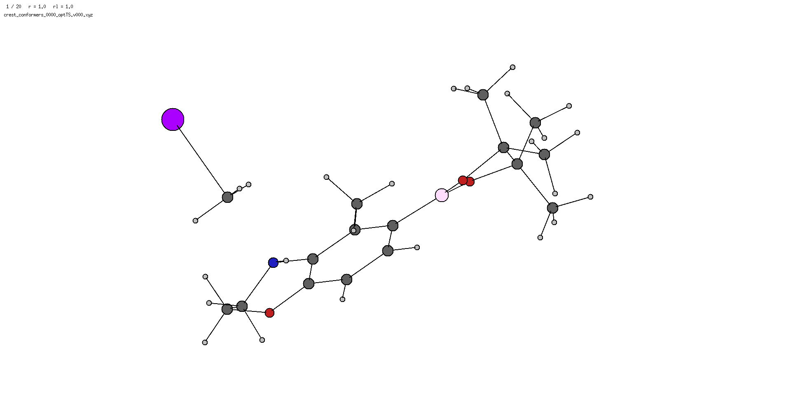

# vib_analysis

> **Automated vibrational mode analysis and structural transformation detection**

Identify bond formation/breaking, angle changes, and dihedral rotations from vibrational trajectories with optional graph-based transformation analysis.

[](https://pepy.tech/projects/vib-analysis)

---

## Table of Contents

- [Features](#features)
- [Installation](#installation)
- [Quick Start](#quick-start)
- [How It Works](#how-it-works)
- [Examples](#examples)
- [Command Line Interface](#command-line-interface)
- [Python API](#python-api)
- [Advanced Options](#advanced-options)
- [Important Notes](#important-notes)

---

## Features

### Core Analysis
✅ **Automatic trajectory extraction** from XYZ files or QM output (ORCA, Gaussian via cclib)  
✅ **Internal coordinate tracking** - identifies significant bond, angle, and dihedral changes  
✅ **Smart filtering** - separates primary changes from coupled secondary effects  

### Graph-Based Analysis (Optional)
🔍 **Bond formation/cleavage detection**  
🔍 **Bond order changes** (single ↔ double ↔ triple)  
🔍 **Formal charge redistribution** tracking  
🔍 **ASCII molecular visualization** of transformations

>[!IMPORTANT]
> Bond orders and formal charges are **empirically assigned** by [xyzgraph](https://github.com/aligfellow/xyzgraph) and should be treated as **indicative only**.   
> They are particularly unreliable for metal-containing systems. Use them as qualitative guides, not quantitative predictions.  
> Needs installed for this analysis `pip install git+https://github.com/aligfellow/xyzgraph.git`  

---

## Installation

### From PyPI
```bash
pip install vib-analysis
```

### From Source (*up-to-date*)
```bash
git clone https://github.com/aligfellow/vib_analysis.git
cd vib_analysis
pip install .
```

### Dependencies
**Required:**
- `ase` - Atomic Simulation Environment
- `numpy` - Numerical operations
- `networkx` - Graph operations
- `xyzgraph` - Molecular graph construction (does the graph analysis)

**Optional:**
- `cclib` - Parsing Gaussian/ORCA output
- ORCA with `orca_pltvib` in PATH

---

## Quick Start

```bash
# Simple bond analysis
vib_analysis trajectory.xyz

# With graph-based transformation detection
vib_analysis calculation.out --graph

# Save structures for IRC calculations
vib_analysis calculation.out --save-displacement
```

---

## How It Works

### Analysis Workflow

```
┌─────────────────────────────────────────────────────────────────┐
│                         INPUT FILES                             │
│            (XYZ trajectory or QM output file)                   │
└────────────────────────────┬────────────────────────────────────┘
                             │
                             ▼
┌─────────────────────────────────────────────────────────────────┐
│                  STEP 1: LOAD TRAJECTORY                        │
│                                                                 │
│  • XYZ file → direct read                                       │
│  • QM output → cclib parser → trajectory                        │
│  • QM output → orca_pltvib → trajectory (fallback)              │
│                                                                 │
│  Output: List[ASE Atoms], frequencies (optional)                │
└────────────────────────────┬────────────────────────────────────┘
                             │
                             ▼
┌─────────────────────────────────────────────────────────────────┐
│            STEP 2: INTERNAL COORDINATE ANALYSIS                 │
│                      (core.py)                                  │
│                                                                 │
│  1. Build neighbor lists (bond/angle/dihedral detection)        │
│  2. Calculate coordinate changes across frames                  │
│  3. Filter by thresholds (bond_threshold, angle_threshold)      │
│  4. Classify: primary vs coupled secondary changes              │
│                                                                 │
│  Output: bond_changes, angle_changes, dihedral_changes          │
└────────────────────────────┬────────────────────────────────────┘
                             │
                             ▼
                    ┌────────┴────────┐
                    │  Graph Analysis?│
                    └────────┬──────┬─┘
                         Yes │   No └─────────────────────────────┐
                             ▼                                    │
┌─────────────────────────────────────────────────────┐           │
│    STEP 3: GRAPH-BASED ANALYSIS (Optional)          │           │
│              (graph_compare.py)                     │           │
│                                                     │           │
│  Uses xyzgraph to:                                  │           │
│  ┌─────────────────────────────────────────────┐    │           │
│  │ 1. Build molecular graphs                   │    │           │
│  │    • Transition state graph                 │    │           │
│  │    • Displaced frame graphs                 │    │           │
│  │                                             │    │           │
│  │ 2. Assign bond orders (empirical!)          │    │           │
│  │                                             │    │           │
│  │ 3. Assign formal charges (empirical!)       │    │           │
│  └─────────────────────────────────────────────┘    │           │
│                                                     │           │
│  Our code then:                                     │           │
│  • Compares TS vs displaced graphs                  │           │
│  • Identifies bonds formed/broken                   │           │
│  • Tracks bond order changes                        │           │
│  • Calculates charge redistribution                 │           │
│  • Generates ASCII visualization                    │           │
│                                                     │           │
│  Output: graph comparison, ASCII structures         │           │
└────────────────────────────┬────────────────────────┘           │
                             │                                    │
                             └────────────┬───────────────────────┘
                                          ▼
┌─────────────────────────────────────────────────────────────────┐
│                    STEP 4: OUTPUT FORMATTING                    │
│                        (output.py)                              │
│                                                                 │
│  • VIB_ANALYSIS header                                          │
│  • Debug information (if requested)                             │
│  • Graph analysis summary (if enabled)                          │
│  • Vibrational trajectory analysis                              │
│  • Bond/angle/dihedral changes                                  │
│                                                                 │
└─────────────────────────────────────────────────────────────────┘
```

### Key Components

**xyzgraph's Role (Heavy Lifting):**
- Constructs molecular graphs from 3D coordinates
- Assigns bond orders using empirical rules
- Calculates formal charges using valence rules
- Provides the graph infrastructure we build upon

**Core Analysis:**
- Selects relevant frames for comparison
- Identifies which bonds/angles/dihedrals change
- Compares graphs to detect transformations
- Filters and classifies changes

---

## Examples

> **Note:** All atom indices are **zero-indexed**

### Example 1: SN2 Reaction


```bash
vib_analysis examples/data/sn2.v000.xyz
```

**Output:**
```
================================================================================
                              VIB_ANALYSIS
================================================================================

================================================================================
                    VIBRATIONAL TRAJECTORY ANALYSIS
================================================================================

=========================== Significant Bond Changes ===========================
Bond (0, 4)  [C-F]   Δ =   1.584 Å,  Initial =   1.717 Å
Bond (0, 5)  [C-Cl]  Δ =   1.355 Å,  Initial =   1.952 Å

================================================================================
```

**Interpretation:** Classic SN2 mechanism - C-F bond breaking concurrent with C-Cl bond forming.

---

### Example 2: Dihedral Rotation


```bash
vib_analysis examples/data/dihedral.v000.xyz
```

**Output:**
```
================================================================================
                              VIB_ANALYSIS
================================================================================

================================================================================
                    VIBRATIONAL TRAJECTORY ANALYSIS
================================================================================

========================= Significant Dihedral Changes =========================
Dihedral (6, 0, 3, 7)  [F-C-C-F]  Δ =  43.778 °,  Initial = 359.998 °

================================================================================
```

**Interpretation:** Internal rotation about C-C bond causing F-C-C-F dihedral change of ~44°.

---

### Example 3: Complex Rearrangement (Basic Analysis)


```bash
vib_analysis examples/data/bimp.v000.xyz
```

**Output:**
```
================================================================================
                              VIB_ANALYSIS
================================================================================

================================================================================
                    VIBRATIONAL TRAJECTORY ANALYSIS
================================================================================

=========================== Significant Bond Changes ===========================
Bond (11, 12)  [O-C]  Δ =   2.052 Å,  Initial =   2.064 Å
Bond (10, 14)  [C-C]  Δ =   0.426 Å,  Initial =   2.656 Å

================================================================================
```

**Interpretation:** Two significant bond changes detected - O-C formation and C-C breaking (formal \[2,3]-rearrangement).

---

### Example 4: With Graph Analysis & Charge Redistribution

```bash
vib_analysis examples/data/bimp.out -g
```

**Output (excerpt):**
```
vib_analysis examples/data/bimp.out -g -as 2
================================================================================
                              VIB_ANALYSIS
================================================================================

Analyzed Mode 0: -333.88 cm⁻¹ (imaginary)

First 5 non-zero vibrational frequencies:
  Mode 0: -333.88 cm⁻¹ (imaginary)
  Mode 1: 8.57 cm⁻¹
  Mode 2: 12.72 cm⁻¹
  Mode 3: 13.27 cm⁻¹
  Mode 4: 15.83 cm⁻¹

================================================================================
                         VIBRATIONAL GRAPH ANALYSIS SUMMARY
================================================================================

Bonds Formed (1):
  Bond (11, 12) [O-C]: formed as single (order=1.0)

Bonds Broken (1):
  Bond (10, 14) [C-C]: broken from single (order=1.0)

Interpret with care, bond orders and charges are empirical and LOW confidence.

Bond Order Changes (4 bonds):
  Bond (1, 10) [C-C]: single→double (order 1.0→2.0)
  Bond (13, 14) [C-C]: single→double (order 1.0→2.0)
  Bond (1, 2) [C-N]: double→single (order 2.0→1.0)
  Bond (13, 31) [C-N]: double→single (order 2.0→1.0)

Formal Charge Redistribution (4 atoms):
  Atom 2 [N]: charge +1→+0 (Δq = -1.00)
  Atom 11 [O]: charge -1→+0 (Δq = +1.00)
  Atom 12 [C]: charge -1→+0 (Δq = +1.00)
  Atom 31 [N]: charge +1→+0 (Δq = -1.00)

================================================================================
ASCII REPRESENTATIONS
================================================================================

Transition State (TS):

           C‖
           ‖‖
           ‖‖
            ‖‖
            ‖‖    ------O
C-----------C‖----       **
            *              *
            *               **
           *                 /C
           *                /
          -C==           ///
      ---- =========    /
  ----        ========C/
C-                  ===

Frame 1:

           C
           |
           |
            |
            |     ------O
C-----------C-----
            |
            |
           |                 /C
           |                /
          -C--           ///
      ----    ------    /
  ----              --C/
C-

Frame 2:

           C‖
           ‖‖
           ‖‖
            ‖‖
            ‖‖    ------O
C-----------C‖----       \\
                           \
                            \\
                             /C
                            /
          -C==           ///
      ---- =========    /
  ----        ========C/
C-                  ===

================================================================================
                    VIBRATIONAL TRAJECTORY ANALYSIS
================================================================================

=========================== Significant Bond Changes ===========================
Bond (11, 12)  [O-C]  Δ =   2.052 Å,  Initial =   2.064 Å
Bond (10, 14)  [C-C]  Δ =   0.426 Å,  Initial =   2.656 Å

================================================================================
```

**Interpretation:** Graph analysis reveals a rearrangement with bond formation/breaking, bond order changes, and charge redistribution. 

---

### Example 5: Showing All Changes (Including Minor)

```bash
vib_analysis examples/data/bimp.v000.xyz --all
```

Shows additional "Minor Angle Changes" and "Minor Dihedral Changes" sections with coupled secondary effects.

---

### Example 6: Larger SN2 System



```bash
vib_analysis examples/data/sn2_large.v000.xyz
```

**Output:**
```
================================================================================
                              VIB_ANALYSIS
================================================================================

================================================================================
                    VIBRATIONAL TRAJECTORY ANALYSIS
================================================================================

=========================== Significant Bond Changes ===========================
Bond (0, 21)  [C-N]  Δ =   2.388 Å,  Initial =   2.158 Å
Bond (0, 1)   [C-I]  Δ =   1.878 Å,  Initial =   2.563 Å

================================================================================
```

**Interpretation:** SN2 reaction in larger molecular context - C-I bond breaking and C-N bond forming.

---

### Example 7: Mn Catalyst Hydrogenation


```bash
vib_analysis examples/data/mn.log --all
```

**Output:**
```
================================================================================
                              VIB_ANALYSIS
================================================================================

Analyzed Mode 0: -748.48 cm⁻¹ (imaginary)

First 5 non-zero vibrational frequencies:
  Mode 0: -748.48 cm⁻¹ (imaginary)
  Mode 1: 20.26 cm⁻¹
  Mode 2: 25.12 cm⁻¹
  Mode 3: 32.45 cm⁻¹
  Mode 4: 36.68 cm⁻¹

================================================================================
                    VIBRATIONAL TRAJECTORY ANALYSIS
================================================================================

=========================== Significant Bond Changes ===========================
Bond (5, 65)   [N-H]   Δ =   1.776 Å,  Initial =   1.319 Å
Bond (65, 66)  [H-O]   Δ =   1.665 Å,  Initial =   1.203 Å
Bond (64, 66)  [H-O]   Δ =   0.920 Å,  Initial =   1.711 Å
Bond (1, 65)   [Mn-H]  Δ =   0.875 Å,  Initial =   2.591 Å
Bond (1, 64)   [Mn-H]  Δ =   0.649 Å,  Initial =   1.898 Å

============================= Minor Angle Changes ==============================
Angle (64, 63, 1)  [H-H-Mn]  Δ =  45.388 °,  Initial =  88.897 °
Angle (5, 1, 63)   [N-Mn-H]  Δ =  16.471 °,  Initial =  96.799 °
Angle (61, 1, 63)  [C-Mn-H]  Δ =  15.528 °,  Initial =  81.202 °
Angle (2, 1, 63)   [P-Mn-H]  Δ =  13.032 °,  Initial = 171.266 °

Note: These angles depend on other changes and may not be significant alone.

============================ Minor Dihedral Changes ============================
Dihedral (63, 1, 2, 36)  [H-Mn-P-C]  Δ =  81.780 °,  Initial = 283.248 °

Note: These dihedrals depend on other changes and may not be significant alone.

================================================================================
```

**Interpretation:** Hydrogenation mechanism involving multiple N-H, H-O, and Mn-H bond changes. Note the handling of metal-ligand interactions.

---

## Command Line Interface

### Basic Usage

```bash
vib_analysis <input_file> [options]
```

### Common Options

| Option | Description | Default |
|--------|-------------|---------|
| `-m, --mode N` | Vibrational mode index | 0 |
| `-g, --graph` | Enable graph analysis | False |
| `-d, --debug` | Enable debug output | False |
| `-v, --verbose` | Verbose logging | False |
| `-a, --all` | Show all changes (including minor) | False |
| `--save-displacement` | Save displaced structures | False |

### Threshold Tuning

```bash
# Adjust bond detection sensitivity
vib_analysis input.xyz --bond-threshold 0.3

# Adjust angle detection
vib_analysis input.xyz --angle-threshold 15.0

# Advanced: tune bond stability filtering
vib_analysis input.xyz --bond-stability 0.15
```

### Graph Analysis Options

```bash
# With ASCII visualization
vib_analysis input.xyz -g --ascii-scale 2.5 --show-h

# Adjust display around reactive center
vib_analysis input.xyz -g --ascii-shells 2

# Set molecular charge
vib_analysis input.xyz -g --charge -1
```

### Output Control

```bash
# Save displaced structures
vib_analysis input.xyz --save-displacement --displacement-scale 2
# or
vib_analysis input.xyz -sd -ds 2


# Don't save trajectory to disk
vib_analysis input.xyz --no-save

# Specify ORCA path
vib_analysis input.out --orca-path /opt/orca
```

### Complete Example

```bash
vib_analysis bimp.out \
  --mode 0 \
  --graph \
  --debug \
  --save-displacement \
  --ascii-shells 1 \
  --ascii-scale 2.5
```

---

## Python API

### Basic Analysis

```python
from vib_analysis import run_analysis

# Run analysis
results = run_analysis('trajectory.xyz')

# Access bond changes
for bond, (delta, initial) in results['vibrational']['bond_changes'].items():
    i, j = bond
    symbols = results['vibrational']['atom_index_map']
    print(f"Bond ({i},{j}) [{symbols[i]}-{symbols[j]}]: Δ={delta:.3f} Å")
```

### With Formatted Output

```python
from vib_analysis import run_analysis
from vib_analysis.utils import setup_logging

# Configure logging
setup_logging(debug=True)

# Run with formatted output
results = run_analysis(
    'calculation.out',
    mode=0,
    enable_graph=True,
    print_output=True,  # Display formatted results
    save_displacement=True,
    verbose=True
)
```

### Customized Analysis

```python
results = run_analysis(
    'trajectory.xyz',
    # Detection sensitivity
    bond_tolerance=1.4,
    angle_tolerance=1.1,
    dihedral_tolerance=1.0,
    # Reporting thresholds
    bond_threshold=0.4,
    angle_threshold=10.0,
    dihedral_threshold=20.0,
    bond_stability_threshold=0.2,
    # Graph analysis
    enable_graph=True,
    graph_method='cheminf',
    charge=0,
    ascii_scale=2.5,
    ascii_include_h=False,
    # Output
    save_trajectory=True,
    save_displacement=False,
    print_output=False
)
```

### Results Structure

```python
{
    'trajectory': {
        'frames': List[Atoms],      # ASE Atoms objects
        'frequencies': List[float],  # cm⁻¹ (None for XYZ)
        'trajectory_file': str       # Path to saved file
    },
    'vibrational': {
        'bond_changes': Dict[Tuple, Tuple[float, float]],
        'angle_changes': Dict[Tuple, Tuple[float, float]],
        'dihedral_changes': Dict[Tuple, Tuple[float, float]],
        'minor_angle_changes': Dict,
        'minor_dihedral_changes': Dict,
        'frame_indices': List[int],
        'atom_index_map': Dict[int, str]
    },
    'graph': {                       # Only if enable_graph=True
        'comparison': Dict,
        'ts_graph': nx.Graph,
        'frame1_graph': nx.Graph,
        'frame2_graph': nx.Graph,
        'ascii_ts': str,
        'ascii_ref': str,
        'ascii_disp': str
    },
    'displacement_files': Tuple[str, str]  # If save_displacement=True
}
```

### Validation Example

```python
from vib_analysis import run_analysis

# Run analysis
results = run_analysis('bimp.v000.xyz')

# Validate against expected changes
expected_bonds = [(11, 12), (10, 14)]
found_bonds = list(results['vibrational']['bond_changes'].keys())

if all(bond in found_bonds for bond in expected_bonds):
    print("✓ All expected bond changes detected")
else:
    print("✗ Some bond changes missing")
```

---

## Advanced Options

### Configuration Parameters

All defaults are in `config.py` and can be overridden:

**Detection Tolerances:**
```python
BOND_TOLERANCE = 1.4        # Multiplier for covalent radii
ANGLE_TOLERANCE = 1.1
DIHEDRAL_TOLERANCE = 1.0
```

**Significance Thresholds:**
```python
BOND_THRESHOLD = 0.4        # Minimum Δ (Å)
ANGLE_THRESHOLD = 10.0      # Minimum Δ (degrees)
DIHEDRAL_THRESHOLD = 20.0   # Minimum Δ (degrees)
BOND_STABILITY_THRESHOLD = 0.2  # For filtering coupled changes
```

**Graph Analysis:**
```python
DISTANCE_TOLERANCE = 0.2    # Bond formation/breaking (Å)
ASCII_SCALE = 2.5           # Rendering scale
ASCII_NEIGHBOR_SHELLS = 1   # Expansion around reactive center
```

### Displaced Structure Export

Generate structures for IRC or optimization:

```bash
# Default: ±1 amplitude (~0.2)
vib_analysis input.xyz --save-displacement

# Higher amplitude: ±2 (~0.4)
vib_analysis input.xyz --save-displacement --level 2

# Creates: input_F.xyz (forward), input_R.xyz (reverse)
```

Displacement levels 1-4 correspond to amplitudes ~0.2, 0.4, 0.6, 0.8.

### Custom Frame Selection

```bash
# Override TS frame
vib_analysis input.xyz --ts-frame 5
```

By default, frames with maximum RMSD are selected automatically.

---

## Important Notes

### ⚠️ Bond Orders and Formal Charges

**Empirical Assignment:** Bond orders and formal charges are assigned by **xyzgraph** using empirical rules based on:
- Atomic valences
- Electronegativity
- Geometric criteria

**Reliability:**
- ✅ **Reliable** for simple organic molecules
- ⚠️ **Uncertain** for charged species, radicals
- ❌ **Unreliable** for transition metals, lanthanides, actinides

**Use as indicators only!** Always cross-validate with:
- IRC
- optimisations of displaced structures
- chemical insight

### File Formats

**Supported Inputs:**
- XYZ trajectory (`.xyz`) - direct read
- ORCA output (`.out`) - via cclib or orca_pltvib
- Gaussian (`.log`) - via cclib

**XYZ Format:**
```
<n_atoms>
Comment line
<symbol> <x> <y> <z>
...
```

Must contain ≥2 frames.

---

## Acknowledgments

- Built with [ASE](https://wiki.fysik.dtu.dk/ase/) for molecular structures
- Uses [xyzgraph](https://github.com/aligfellow/xyzgraph) for graph construction
- QM output parsing via [cclib](https://github.com/cclib/cclib)
- Visualization examples with [v.2.0](https://github.com/briling/v) by Ksenia Briling

---

